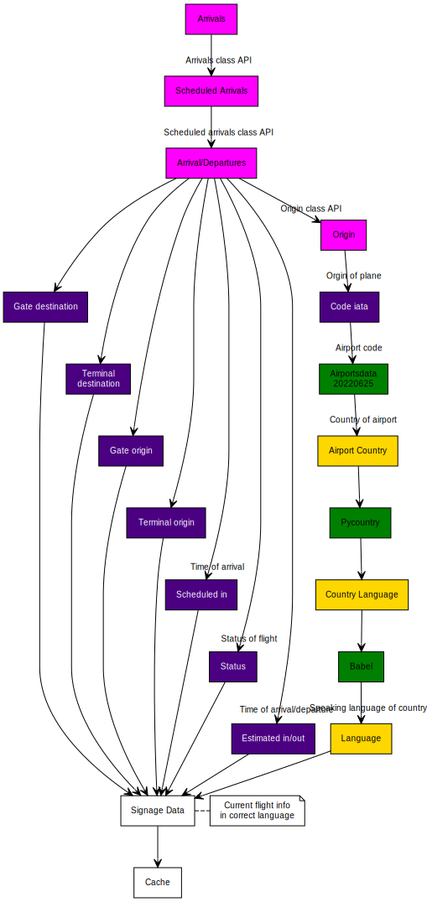

# Predictive-Airport-Signage

Proof of concept application which gets incoming arrivals at airports and predicts the most appropriate signage to display based on the nationality of arrivals, distance from gate and more.

## General Requirements (Most to least important)

- Retrieve and store incoming arrivals data for airpots
- Predict the likely nationalities of passengers and by association sign language
- Provide a REST API to provide access to the data
- Provide a basic webpage to view data from the API (Mock sign)
- Build and deploy the application as a container
- Provide a WebSocket for ongoing updates to the signage data
- Retrieve and provide data on estimated number of passengers (possibly from plane type)
- Update information based on passenger travel times from landing to departure hall (could include walking distance, delays for immigration and baggage relclaim)
## Airport API
To grab data for the project we will use an API if unavalible other methods are web-scraping for getting data.
### Aviation stack
Using api from aviationstack.com to get infomation on airport arival times,departures and more.
```json
{
    "aircraft": null,
    "airline": {
        "iata": "GJ",
        "icao": "CDC",
        "name": "Loong Air"
    },
    "arrival": {
        "actual": null,
        "actual_runway": null,
        "airport": "Hangzhou",
        "baggage": null,
        "delay": null,
        "estimated": "2022-06-28T03:25:00+00:00",
        "estimated_runway": null,
        "gate": null,
        "iata": "HGH",
        "icao": "ZSHC",
        "scheduled": "2022-06-28T03:25:00+00:00",
        "terminal": null,
        "scheduled": "2022-06-28T00:05:00+00:00",
        "terminal": null,
        "timezone": "Asia/Shanghai"
    },
    "flight": {
        "codeshared": null,
        "iata": "GJ8711",
        "icao": "CDC8711",
        "number": "8711"
    },
    "flight_date": "2022-06-28",
    "flight_status": "scheduled",
    "live": null
}
```
The free plan doesn't have a search option therefore we cannot use this API.
we looked at flightstats.com as an alternative it has a lot of infomation however account cannot be authorized in time.
### FlightAware
Being unable to use previous options attempt 3 was made on a new api from uk.flightaware.com to give arrival and departure info.

```json
{
  "arrivals": [
    {
      "ident": "BAW196",
      "ident_icao": "BAW196",
      "ident_iata": "BA196",
      "fa_flight_id": "BAW196-1656120840-schedule-0121",
      "operator": "BAW",
      "operator_icao": "BAW",
      "operator_iata": "BA",
      "flight_number": "196",
      "registration": "G-ZBKF",
      "atc_ident": "BAW196E",
      "inbound_fa_flight_id": "BAW197-1656076560-schedule-0267",
      "codeshares": [
        "AAL6953",
        "EIN8896",
        "FIN5496",
        "IBE7391"
      ],
      "codeshares_iata": [
        "AA6953",
        "EI8896",
        "AY5496",
        "IB7391"
      ],
      "blocked": false,
      "diverted": false,
      "cancelled": false,
      "position_only": false,
      "origin": {
        "code": "KIAH",
        "code_icao": "KIAH",
        "code_iata": "IAH",
        "code_lid": "IAH",
        "airport_info_url": "/airports/KIAH"
      },
      "destination": {
        "code": "EGLL",
        "code_icao": "EGLL",
        "code_iata": "LHR",
        "code_lid": null,
        "airport_info_url": "/airports/EGLL"
      },
      "departure_delay": 960,
      "arrival_delay": -60,
      "filed_ete": 30000,
      "scheduled_out": "2022-06-27T01:30:00Z",
      "estimated_out": "2022-06-27T01:39:00Z",
      "actual_out": "2022-06-27T01:46:00Z",
      "scheduled_off": "2022-06-27T01:40:00Z",
      "estimated_off": "2022-06-27T02:03:09Z",
      "actual_off": "2022-06-27T02:03:09Z",
      "scheduled_on": "2022-06-27T10:00:00Z",
      "estimated_on": "2022-06-27T10:30:00Z",
      "actual_on": "2022-06-27T10:30:00Z",
      "scheduled_in": "2022-06-27T10:40:00Z",
      "estimated_in": "2022-06-27T10:39:00Z",
      "actual_in": null,
      "progress_percent": 100,
      "status": "Landed / Taxiing",
      "aircraft_type": "B789",
      "route_distance": 4829,
      "filed_airspeed": 482,
      "filed_altitude": 390,
      "route": "CEFOU N511A RIKAL NATW MALOT NATW GISTI SLANY UL9 STU P2 BEDEK",
      "baggage_claim": null,
      "seats_cabin_business": null,
      "seats_cabin_coach": null,
      "seats_cabin_first": null,
      "gate_origin": "D7",
      "gate_destination": null,
      "terminal_origin": "D",
      "terminal_destination": "5",
      "type": "Airline"
    },
    
  ],
  "links": {
    "next": "/airports/LHR/flights/arrivals?cursor=b422e1642a81971"
  },
  "num_pages": 1
}
```

### Country to language

We can use Pycountry (https://pypi.org/project/pycountry/) to find the associated language for the country that the plane is coming from. It uses ISO 639-3 for the Languages and 3166 for the Countries.
## Architecture
This is our basic architecture for our project





The processor will retrieve data from the FlightAware API and use PyCountry as well as Airportsdata to find the language of the departure/arrival country. This will then be cached for the next few hours of data (to limit API usage) and the language will be displayed accordingly at the corresponding time. The cache will the be used for displaying the result on a website using the RestAPI as the current info and updating it with the Web Socket.

The processor, cache and API/Web Page will be deployed in docker containers, in order to make management scalability easier.


## Frontend
These are the screenshots from the front end website 


